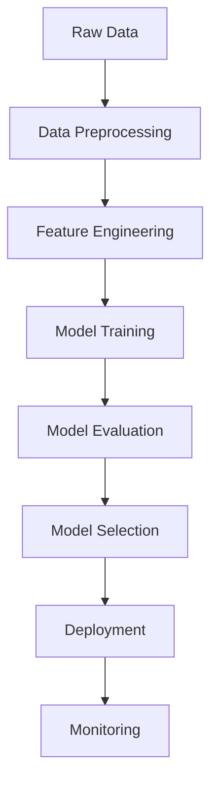

# End-to-End Machine Learning

Welcome to the End-to-End Machine Learning project. This repository provides a comprehensive solution for building, training, evaluating, and deploying machine learning models. It covers the full data science workflow from data preprocessing through to model deployment and monitoring, making it an ideal starting point for both experimentation and production-level ML pipelines.

## Features

- Complete machine learning pipeline: data preprocessing, feature engineering, model selection, training, evaluation, and deployment.
- Modular architecture for easy extension and customization.
- Automated data validation and cleaning.
- Support for multiple machine learning algorithms.
- Integrated model evaluation and reporting.
- Scalable deployment options for various environments.
- Configurable through YAML or JSON files.
- Logging and monitoring for production readiness.

## Requirements

To run this project, make sure your environment meets the following requirements:

- Python 3.7 or above
- pip (latest version recommended)
- Common ML/data science libraries:
  - numpy
  - pandas
  - scikit-learn
  - matplotlib
  - seaborn
  - joblib
  - pyyaml or json (for configuration)
- (Optional) Flask or FastAPI if using the deployment APIs
- (Optional) Docker for containerized deployment

You can install all core dependencies using the provided requirements file.

## Installation

Follow these steps to set up the project on your local machine:

1. **Clone the repository**

    ```bash
    git clone https://github.com/SameaSaeed/End-to_End_ML.git
    cd End-to_End_ML
    ```

2. **Create a virtual environment (optional but recommended)**

    ```bash
    python3 -m venv venv
    source venv/bin/activate  # On Windows: venv\Scripts\activate
    ```

3. **Install the required packages**

    ```bash
    pip install -r requirements.txt
    ```

4. **Set up configuration files**

    - Copy and modify the example configuration as needed.

## Usage

This project is structured to be run step-by-step or as an integrated pipeline. The typical workflow is:

1. **Prepare your data:** Place your dataset in the `data/` directory.
2. **Configure your pipeline:** Edit the configuration file (`config.yaml` or `config.json`) to specify data sources, preprocessing, model parameters, and outputs.
3. **Run the pipeline:** Execute the main script to launch the pipeline.

```bash
python main.py --config config.yaml
```

4. **Results and outputs:** Processed data, models, and reports will be saved to the `outputs/` directory.

### Example Workflow

```bash
python main.py --config configs/classification_example.yaml
```

#### Data Processing

- Automatic cleaning, missing value handling, and feature engineering.

#### Model Training

- Choose from multiple algorithms by editing the configuration.

#### Evaluation

- View accuracy, confusion matrix, and other metrics in the console and saved reports.

#### Deployment

- Serve the best model using the provided API scripts or Dockerfile.

## Configuration

The pipeline is highly configurable via YAML or JSON files. Main configuration parameters include:

- **data_path:** Path to your CSV or dataset file.
- **target_column:** Name of the target variable for prediction.
- **preprocessing:** Specify steps like missing value imputation, encoding, scaling.
- **model:** Choose the algorithm (e.g., RandomForest, SVM, LogisticRegression), and set hyperparameters.
- **evaluation:** Metrics to compute (accuracy, precision, recall, etc.).
- **output_path:** Where to save models, logs, and reports.

Example config snippet (YAML):

```yaml
data_path: data/train.csv
target_column: "label"
preprocessing:
  impute: "mean"
  encode: "onehot"
  scale: "standard"
model:
  type: "RandomForest"
  params:
    n_estimators: 100
    max_depth: 10
evaluation:
  metrics: ["accuracy", "f1", "roc_auc"]
output_path: outputs/
```

## Contributing

Contributions are welcomed! To get started:

- Fork the repository and create a new branch for your feature or bugfix.
- Write clear, maintainable code and update/add tests as needed.
- Submit a pull request with a detailed description of your changes.

### Guidelines

- Follow PEP8 coding standards.
- Write docstrings and comments for clarity.
- Update the README or documentation for any user-facing changes.
- Open an issue to discuss major features before starting.

---

## Project Architecture

Below is an overview of the pipeline structure and data flow:



## Contact

For questions or support, please open an issue on GitHub or contact the maintainer directly through their GitHub profile.
